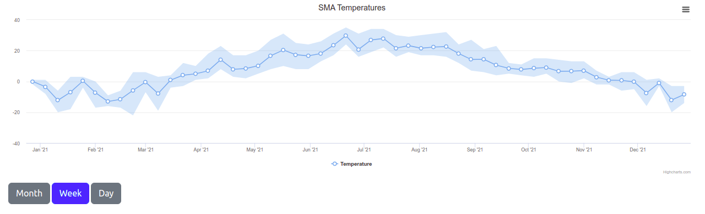

#Источник погоды
https://rp5.ru/%D0%90%D1%80%D1%85%D0%B8%D0%B2_%D0%BF%D0%BE%D0%B3%D0%BE%D0%B4%D1%8B_%D0%B2_%D0%9C%D0%BE%D1%81%D0%BA%D0%B2%D0%B5_(%D1%86%D0%B5%D0%BD%D1%82%D1%80,_%D0%91%D0%B0%D0%BB%D1%87%D1%83%D0%B3)

#Команды
```
docker-compose up -d
docker-compose up -d --force-recreate --no-deps --build postgres
```

#Запуск
localhost:8081

